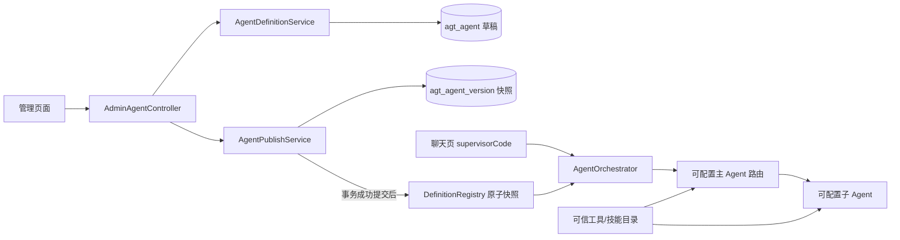

# Agent 配置架构设计

责任人：全栈架构师 Agent；日期：2026-09-10；需求基线：[PRD](PRD.md)。

## 目标与架构

延用 Spring Boot 单体、静态 HTML/JavaScript 和现有 JPA 表，将“创建配置 → 保存草稿 → 启用版本 → 正式对话”连成完整链路。不引入新的前端框架或外部工作流引擎。

## 配置与运行分离

`AgentDefinition` 增加 `skills: string[]`，旧 JSON 缺省为空。全部配置随草稿与历史快照存储，无需增加业务表。新建默认 `DRAFT + enabled=false + publishedVersion=null`，不注册运行。

草稿保存有数据库行锁和 `draftRevision` 检查，只改草稿，不改 Registry；启用会校验当前草稿及关联，生成发布快照并置 `PUBLISHED + enabled=true`。重复启用相同快照复用原版本；发布更新明确创建下一版本。停用保留版本、移除 Registry；回滚创建新版本并同步草稿及名称简介。

发布、启用、停用、回滚通过一个单实例服务生命周期锁串行执行，内部 `TransactionTemplate` 覆盖完整数据库事务。提交成功后再更新 Registry，数据库失败不会留下未提交运行版本。Registry 使用 volatile 不可变 Map，整体重载使用原子引用替换，避免 clear/put 期间读到半张表。

保证范围是单 JVM 服务；本期不实现多实例缓存广播或分布式锁。请求已捕获的版本允许执行完成，停用后新调度查当前 Registry。被引用子 Agent 允许停用；主 Agent 每次路由过滤不可用子项，全部停用时返回可读提示。主 Agent 重新启用/发布会再次验证关联。

## 可信技能与能力

`LocalSkillCatalog` 是项目代码内可信目录，不扫描本机 Codex 技能或执行用户上传文件。技能指令追加到模型系统提示；工具依赖与直接选中工具合并去重；知识技能调用现有检索服务并把结果注入用户提示。运行时再次过滤未经授权 WRITE。主 Agent 可使用只读工具，禁止 WRITE 与不适用技能。

修复原有 ToolCallback 数组被传给 `tools(Object...)` 的错误，使用 Spring AI 的 `toolCallbacks(...)`，实际注册工具定义。移除模型异常时按固定名称自动执行瑕疵补偿流程的旁路。确认操作只使用服务端保存的载荷，并重新检查来源 Agent 仍启用且仍具有工具权限。

## 对话入口与恢复

普通、流式聊天及全链路试运行均传递 `supervisorCode`；缺省为 `supervisor`。显式非法/停用/WORKER 主入口拒绝，不回落固定实现。配置模式默认开启；管理员关闭时拒绝配置启用操作，运行目录显示关闭状态。

local 数据源改为 H2 文件数据库 `./data/cs`（相对 Java gateway 工作目录），支持 `SPRING_DATASOURCE_URL` 覆盖。启动仅按已发布启用快照恢复 Registry，Seed 不覆盖已有修改。生产仍可沿用 PostgreSQL。

## 质量与边界

自动化覆盖草稿隔离、技能实际模型请求和工具绑定/检索调用、主子路由、禁用过滤、版本回滚恢复、输入、权限与并发。独立测试工程师另验数据库提交失败、真实进程重启和浏览器闭环。外部 LLM 服务回答质量与生产身份认证不属于本次已完成保证；原有高级字段未完成项见 [BACKLOG](BACKLOG.md)。
